# Отчет по лабораторной работе №1 базовая настройка PostgreSQL на Debian
### Бихтор Л.А. ИС-22

### 1.  Подготовка среды

1.1  Обновляем список доступных пакетов из репозиториев: 
>```sql
> apt-get update;
>```
1.2  Устанавливаем обновления для всех имеющихся пакетов:
>```sql
>apt-get upgrade
>```
>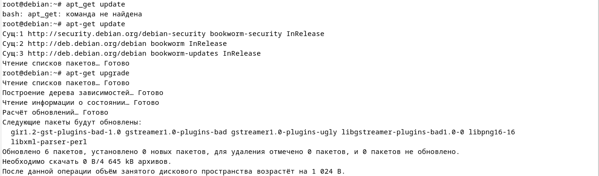

### 2.  Установка PostgreSQL
2.1  Устанавливаем PostgreSQL: 
>```bash
>apt-get install postgresql
>```
### 2.2  Устанавливаем клиентский пакет: 
> ```sql
> apt-get install PostgreSQL-client
> ```
>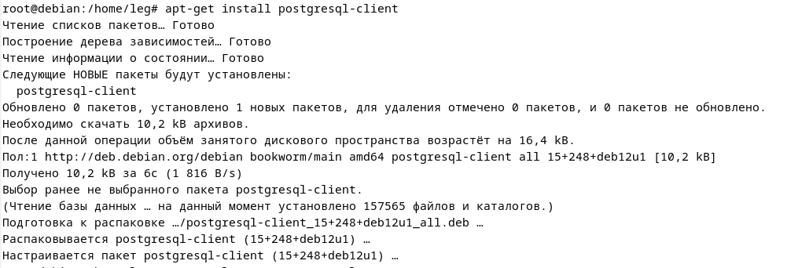

### 2.3  Проверяем статус службы: 
>```bash
>systemctl status PostgreSQL
>```
>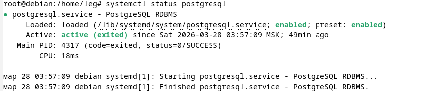

### 3. Создание служебной учётной записи
3.1  Выводим содержимое файла `/etc/passwd`, где хранятся сведения о
    пользователях системы: 
>```bash 
> cat /etc/passwd
>```
>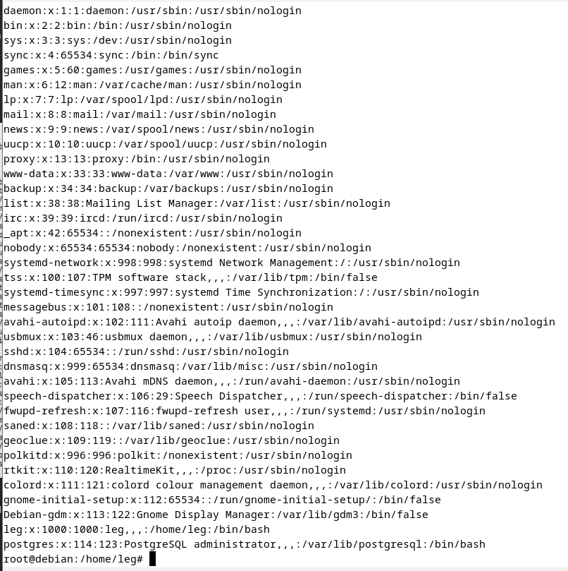

3.2  Для администрирования баз данных переходим на учётную запись
    администратора: 
>```bash
>sudo -i -u postgres
>``` 

3.3  Запускаем оболочку PostgreSQL для выполнения SQL-запросов: 
>```bash
>psql
>```
    
3.4  Выходим из psql (завершаем работу оболочки): 
>```bash
>\q
>``` 

3.5  Выходим из учётной записи администратора БД и возвращаемся к
    обычному пользователю: 
>```bash
>exit
>```
>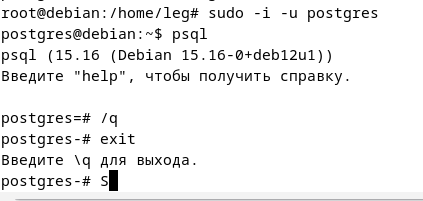

### Пользователь postgres в системе:

-  Не имеет привилегий `root`, но управляет `PostgreSQL`.
-  Обладает полными правами на базы данных `PostgreSQL`.
-  Не может использовать `sudo`, так как это обычный системный
   пользователь.
-  Может запускать psql без пароля, так как является владельцем сервера БД.


### 4.  Первичная настройка конфигурационных файлов

4.1  Открываем каталог PostgreSQL версии 13 и просматриваем его содержимое: 
>```bash
>ls /etc/postgresql/13
>``` 

4.2  Открываем каталог `main`, чтобы проверить, какие файлы находятся внутри: 
>```bash
>sudo ls /etc/postgresql/13/main
>```
>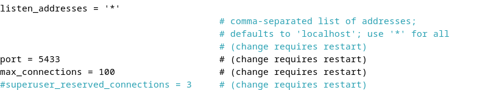 

4.3 Редактируем конфигурационный файл `PostgreSQL`, изменяя порт с 5432 на 5433:
>```sql
>sudo nano /etc/postgresql/13/main/postgresql.conf
>```

4.4 Перезапускаем PostgreSQL, чтобы изменения вступили в силу: 
> ```sql
> sudo systemctl restart postgresql
>```
>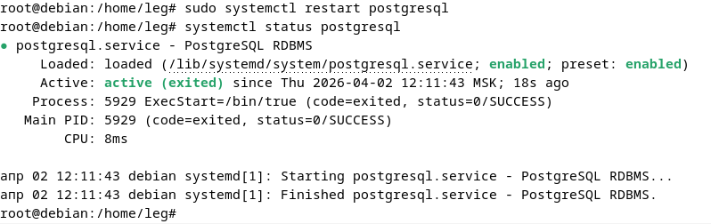 

### Основные файлы конфигурации:
`postgresql.conf` - Основные настройки сервера. Этот файл управляет параметрами работы PostgreSQL, такими как:

>-   порт (`port`)
>-   логирование (`logging_collector`, `log_statement`)
>-   настройки памяти (`shared_buffers`, `work_mem`)
>-   количество подключений (`max_connections`)
>-   параметры сетевого доступа (`listen_addresses`)

`pg_hba.conf` - настройки аутентификации. Этот файл определяет, какие
пользователи могут подключаться, с каких адресов и с каким методом
аутентификации.

`pg_ident.conf` - связывает системных и базовых пользователей. Этот файл
позволяет привязать системные учётные записи Linux к пользователям
PostgreSQL

### 5.  Управление сервисом

-   Проверить статус:
>```bash
> systemctl status postgresql
>```
-   Запустить сервер: 
>```bash
> sudo systemctl start postgresql
>```
-   Остановить сервер:
>```bash
> sudo systemctl stop postgresql
>```
-   Перезапустить сервер:
>```bash
> sudo systemctl restart postgresql
>```
-   Добавить в автозапуск:
>```bash
> sudo systemctl enable postgresql
>```
>
>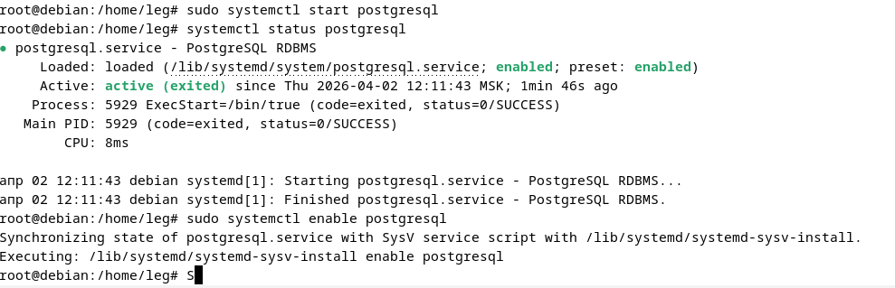 

### 6.  Создание тестовой базы данных

6.1  Запускаем PostgreSQL: 
>```bash\
>psql
>```

6.2 Создаём пользователя с паролем: 
>```sql
>CREATE USER bihtor WITH PASSWORD '1234';
>```

6.3 Создаём базу данных и назначаем владельца: 
>```sql
>CREATE DATABASE dbbihtor OWNER bihtor;
>```

6.4 Выводим список пользователей: 
>```bash
>\du
>```

6.5 Выводим список баз данных: 
>```bash
>\l
>```
>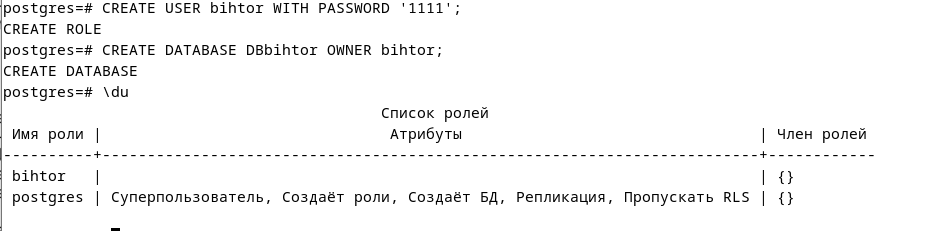 
>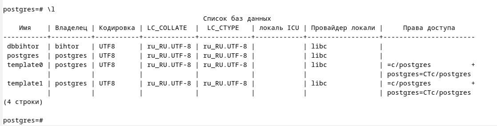 

6.6 Входим в базу данных под созданным пользователем:
>```sql
> psql -U bihtor -d dbbihtor -W;
>```
>
> 
  
6.7 Получаем ошибку: `FATAL: Peer authentication
    failed for user "bihtor"`. Это происходит из-за одноранговой
    аутентификации (`peer`), которая требует, чтобы имя пользователя в
    системе `Linux` совпадало с именем пользователя в `PostgreSQL`.

6.8 Изменяем метод аутентификации с `peer` на `md5` в файле
    `pg_hba.conf`, чтобы разрешить вход по паролю: 
> ```sql
> sudo nano /etc/postgresql/13/main/pg_hba.conf
> ```
>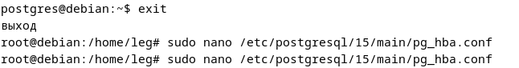.
>.

6.9 Находим строку, относящуюся к локальным подключениям, и заменяем peer на md5:

6.10 Сохраняем изменения и перезапускаем PostgreSQL: 
> ```sql
> sudo systemctl restart postgresql
>```
>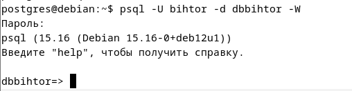.

### 7.  Знакомство со схемами

7.1 Создаём схему test_schema: 
>```bash
>CREATE SCHEMA test_schema
>```

7.2 Даём пользователю `bihtor` права на использование схемы: 
>```sql
>GRANT USAGE ON SCHEMA test_schema TO bihtor;
>```

7.3 Разрешаем пользователю bihtor создавать объекты в схеме:
>```sql
>GRANT CREATE ON SCHEMA test_schema TO bihtor;
>```

7.4 Пробуем выбрать данные из test_schema.public: 
>```sql
>SELECT * FROM test_schema.public;
>```

7.5 Создаём таблицу test_table в test_schema: 
>```sql
> CREATE TABLE test_schema.test_table (id SERIAL PRIMARY KEY, name TEXT NOT NULL);
>```

7.6 Просматриваем содержимое test_table: 
> ```sql
> SELECT * FROM test_schema.test_table;
> ```
>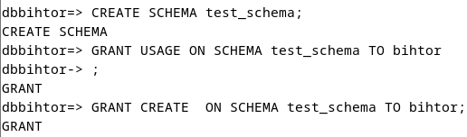.
>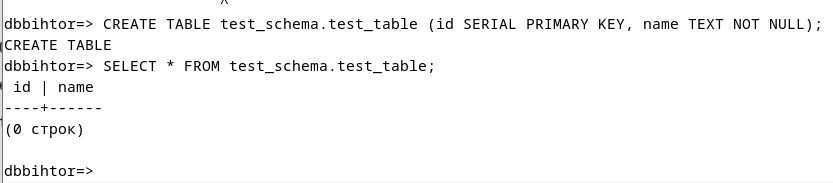.

В `PostgreSQL` схема - это логическая структура внутри базы данных,
которая группирует объекты, такие как таблицы, представления, индексы,
функции и т. д. Схема в `PostgreSQL` похожа на папку внутри базы данных.
Она позволяет организовывать объекты и управлять доступом к ним.

Допустим есть база данных `company_db`. Внутри неё можно создать разные
схемы:

>- `public` - стандартная схема, куда по умолчанию попадают все объекты.
>- `sales` - таблицы, связанные с продажами.
>- `hr` - таблицы, связанные с персоналом.

Вместо создания отдельных баз данных для разных отделов, можно
использовать схемы, что упрощает управление и доступ к данным.

### 8. Использование утилиты psql для базовых операций

8.1  Использовали CREATE, INSERT и SELECT:
>a.  Создали таблицу cars с полями `id` (автоинкрементный первичный
>        ключ), `stamp` (марка автомобиля) и `number` (госномер): 
>```sql
>CREATE TABLE public.cars (id SERIAL PRIMARY KEY, stamp TEXT NOT NULL, number TEXT NOT NULL);
>```
>
>b.  Добавили данные о трёх автомобилях: 
>```sql
>INSERT INTO public.cars (stamp, number) VALUES ('LADA', 'A323CC'), ('HAVAL', 'T400KA'), ('BMW', 'K321OE');
>```
>c.  Просмотрели содержимое таблицы:
>```sql
>SELECT * FROM public.cars;
>```
>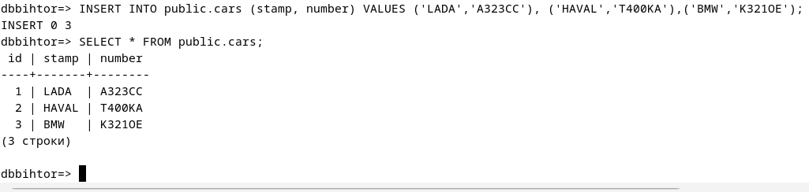.
>

8.2  Обновили через `UPDATE` и удалили через `DELETE`:
>a.  Обновили марку автомобиля с номером `A323CC` на `Honda`: 
>```sql
>UPDATE public.cars SET stamp = 'Honda' WHERE number = 'A323CC';
>```
>
>b.  Проверили изменения с помощью `SELECT`: 
>```sql
>SELECT * FROM public.cars;
>```
>
>c.  Удалили запись с маркой `BMW`:
>```sql
>DELETE FROM public.cars WHERE stamp = 'BMW';
>```
>
>d.  Просмотрели оставшиеся данные после удаления:
>```sql
>SELECT * FROM public.cars;
>```
>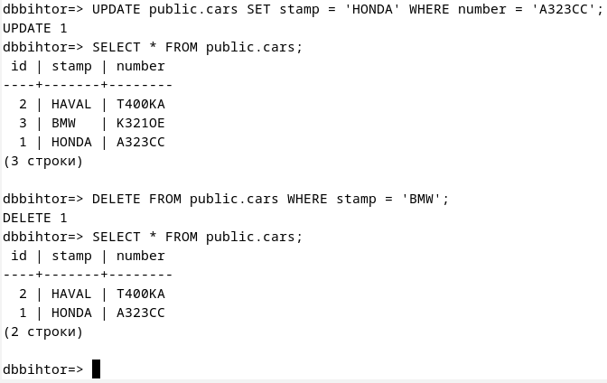.

8.3  Создали таблицу и добавили данные:

>a. Создали таблицу `test_table_leo` в схеме `test_schema`с полями `id` (автоинкрементный первичный ключ), `name` (название) и `country` (страна):
>
>.
>
>b.  Добавили в неё данные:
>
>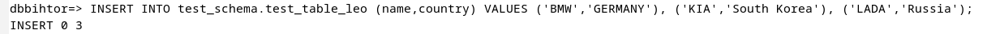.
>
>c.  Пробовали выбрать данные без указания схемы, но получили ошибку, так как таблица находится в `test_schema`, а поиск по умолчанию идёт в `public`. Подметим, что вывод таблицы `cars` при этом спокойно выводится.
>
>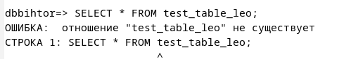.
>
>d.  Чтобы избавиться от ошибки, настроили `search_path`,
> установили порядок поиска схем, добавив `test_schema` перед `public`.
> Пробуем вывести и все выводится без ошибок, потому что мы находимся уже в другом месте:
>
>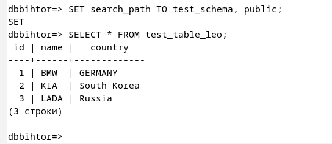.


### 9.  Настройка локальных и сетевых подключений

9.1 Ввели команду для открытия файла и раскомментировали строку listen_addresses, убрав «#» и заменив «localhost» на «*». Это позволяет PostgreSQL принимать подключения
не только локально, но и с других устройств в сети:
>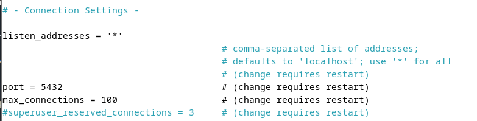.

9.2  По аналогии зашли в файл `pg_hba.conf` и добавили строку: эта настройка разрешает подключения по сети (`host`) ко всем базам данных (all) от всех пользователей (all) с любого IP-адреса (`0.0.0.0/0`) с использованием метода аутентификации `md5`.
>    
>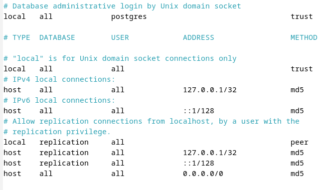.

9.3  Перезапустили PostgreSQL, затем проверили, что сервер слушает подключения на порту `5433` для всех IP-адресов (`0.0.0.0:*`) и
>```bash
>ss -tulnp | grep postgres
>```
>

Команда `ss -tulnp | grep postgres` используется для просмотра сетевых
соединений PostgreSQL:

>-   `ss` - позволяет быстро анализировать сетевые соединения.
>-   `-t` - показывает TCP соединения.
>-   `-u` - показывает UDP соединения.
>-   `-l` - отображает только прослушиваемые порты.
>-   `-n` - выводит IP-адреса и порты в числовом формате.
>-   `-p` - показывает PID процессов и связанные программы.
>-   `grep postgres` - фильтрует вывод, оставляя только строки, связанные с PostgreSQL.

9.4  Получаем адрес виртуальной машины командой `hostname -I` и производим подключение через pgadmin:
>
>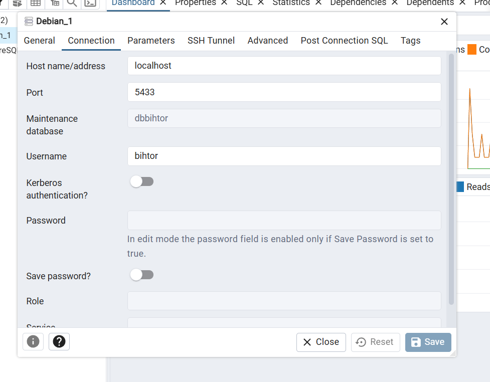.

### 10. Журналирование (logging)

10.1  Изменили настройки журналирования в `postgresql.conf`. Включили `logging_collector = on`, задали каталог логов (`pg_log`), формат имени файла и параметры логирования (`log_statement = 'all'`, `log_connections = on`, `log_disconnections = on`, `log_duration = on`).
>

10.2  Перезапустили сервис PostgreSQL.
10.3  Проверили, что сервис работает.
10.4  Нашли файлы логов в Debian и посмотрели их список: 
>```bash
>ls /var/lib/postgresql/13/main/pg_log/
>```
>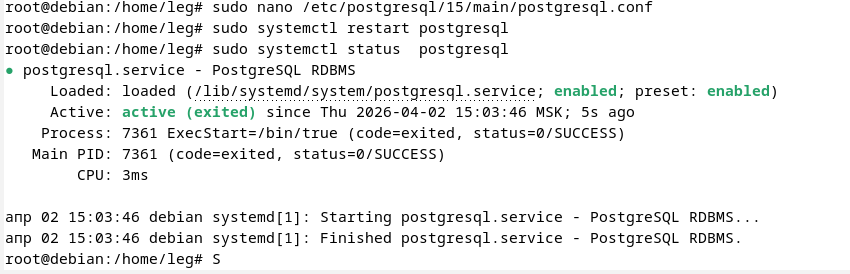
>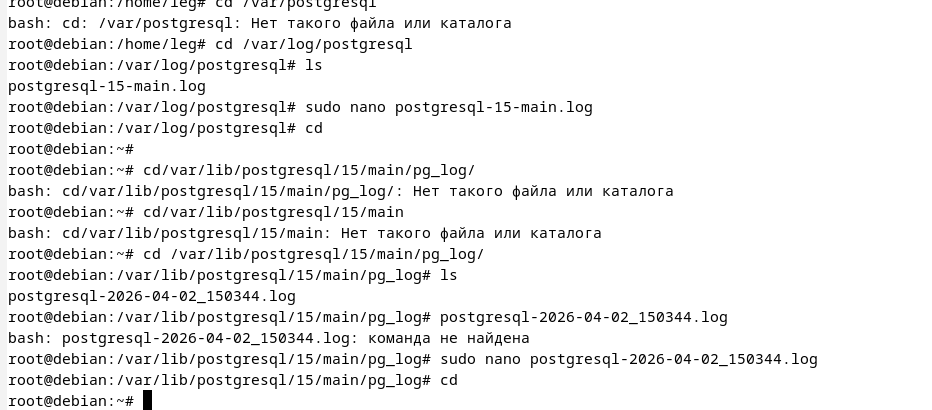

10.5  Открыли лог и проверили записи: 
>```sql
>sudo nano /var/lib/postgresql/13/main/pg_log/postgresql-2025-03-03_233213.log
>```

В логах видно SQL-запросы, подключения, отключения и время выполнения
запросов. Это подтверждает, что журналирование работает и новые записи
появляются.
>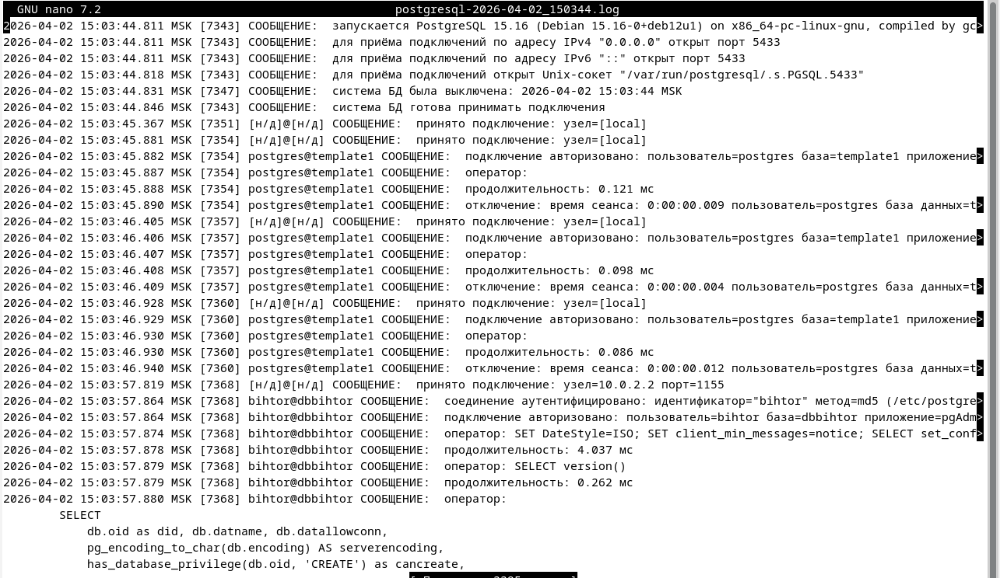

### 11. Назначение ролей и прав

11.1  Создаём роль с ограниченными привилегиями `limited_user`: 
>```sql
>CREATE ROLE limited_user WITH LOGIN PASSWORD '9999';
>```

11.2  Создаём базу данных `lim_db`: 
>```bash
>CREATE DATABASE lim_db;
>```

11.3  Подключаемся к базе `lim_db`: 
>```bash
>\c lim_db
>```

11.4  Создаём таблицу `cars`: 
>```sql
>CREATE TABLE cars ( id SERIAL PRIMARY KEY, name TEXT NOT NULL, number TEXT NOT NULL );
>```

11.5  Добавляем записи в таблицу `cars`.
11.6  Предоставляем `limited_user` доступ к базе: 
>```sql
>GRANT CONNECT ON DATABASE lim_db TO limited_user;
>```

11.7  Разрешаем использование схемы `public`: 
>```sql
>GRANT USAGE ON SCHEMA public TO limited_user;
>```

11.8  Выдаём права `SELECT`, `INSERT`, `UPDATE` на таблицу `cars`: 
>```sql
>GRANT SELECT, INSERT, UPDATE ON public.cars TO limited_user;
>```
>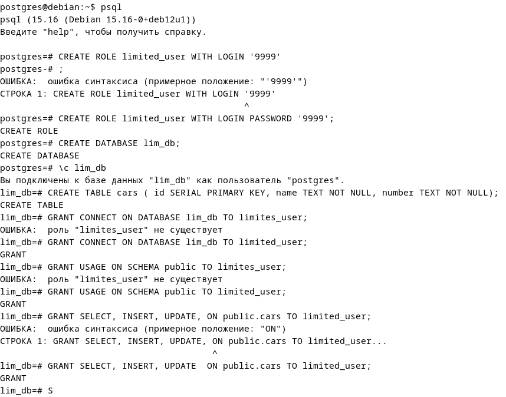

Теперь этот пользователь может читать, добавлять и изменять данные, но
не может удалять записи или изменять структуру таблицы.
>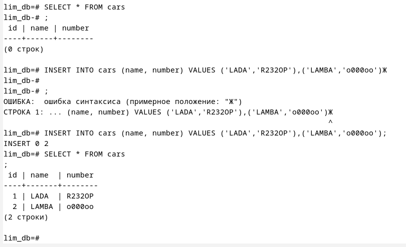

11.9  Создаём роль `god` и даём ей полные права на таблицу `cars`: 
>```sql
>CREATE ROLE god;
>GRANT ALL PRIVILEGES ON cars TO god;
>```

11.10 Наследуем права god для `limited_user`, где `limited_user` получает все привилегии `god`: 
>```bash
>GRANT god TO limited_user;=
>```

11.11 Подключаемся под limited_user и пробуем удалить и проверить данные:
>```sql
>DELETE FROM cars WHERE name = 'LADA'; SELECT * FROM cars;
>```

Теперь `limited_user`, который ранее не имел прав на `DELETE`, теперь может удалять данные благодаря наследованию от `god`.
>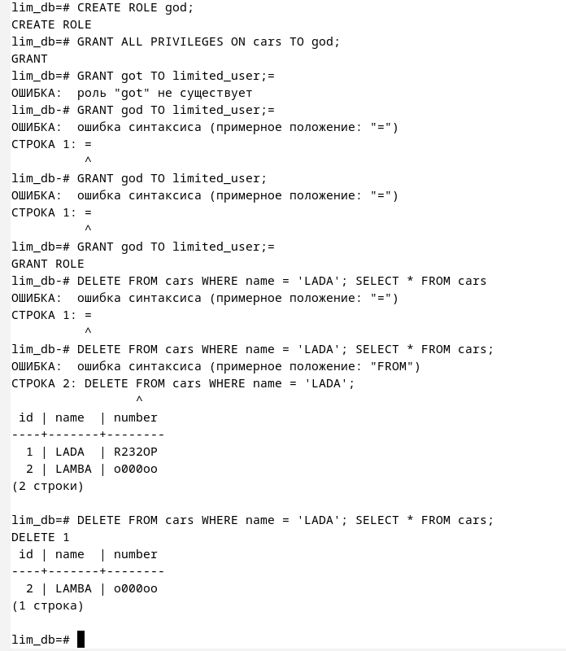
>
>Роль `limited_user` унаследовала полные права на таблицу через `god`, что
>позволило выполнять `DELETE`, несмотря на изначальные ограничения.
